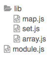
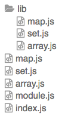

# In Defense of .js

**A Proposal for Node.js Modules**

Dave Herman, Yehuda Katz, Caridy Patiño

# Setting the Stage

In the near future, Node.js will join the front-end JavaScript ecosystem and natively support standard ES2015 JavaScript modules.

JavaScript modules are not always syntactically distinct from CommonJS modules (which parse as `FunctionBody`), so when a user writes `require('some-module')`, we need some way for Node.js to decide whether to evaluate it as a CommonJS module or a standard JavaScript module.

Any acceptable solution ***must not*** introduce significant new overhead to the `require` algorithm, and should support as smooth a transition for both package authors and app authors as we can manage.

Ideally, an npm package transitioning to standard JavaScript modules could do so without impacting other packages or applications that depend on it.

# Leading Solutions

As the Node.js community has worked on a transition plan, people have proposed various solutions to the problem of deciding whether a given `require` should be evaluated as a CommonJS module or a standard JavaScript module.

Among the proposed solutions, we believe that two solutions remain likely candidates:

1. CommonJS modules continue to be named `module-name.js`, while standard JavaScript modules are named `module-name.mjs` in the Node.js ecosystem. It is not necessary for the wider JavaScript ecosystem (web browsers, web frameworks that have already adopted standard JavaScript modules, etc.) to adopt `.mjs` as they can continue to use out-of-band configuration.
2. Packages can opt into standard JavaScript modules or specify which files Node.js should interpret as standard JavaScript modules using `package.json`. This aligns with existing practice in the wider JavaScript ecosystem that has already adopted standard JavaScript modules, but has a number of non-trivial technical and ergonomic challenges.
 
We will argue that opting in through the `package.json` is both technically tractable **and** has the smoothest transition path for new Node.js users as well as existing packages and applications.

# High-Level Constraints

The best part of the discussion so far is that it has crisply identified a number of constraints that members of the community have for the transition to standard JavaScript modules.

We will attempt to outline them here (the best attempt to date to enumerate the constraints is on [the Node.js wiki](https://github.com/nodejs/node/wiki/ES6-Module-Detection-in-Node), which is excellent reading).

1. **Maximum interoperability:** Existing requires ***must*** continue to work with no changes, full stop. We should also minimize the number of changes needed in existing modules, both locally and to applications and packages that use them.
2. **Poly-Packages:** During the transition, it ***must*** be possible for library authors to create packages that work both with older versions of Node.js (especially the last LTS) while still authoring their package primarily using standard JavaScript modules, and for app developers to upgrade large codebases incrementally. We should also minimize the difficulty in authoring such hybrid packages.
3. **Agnostic Usage:** It ***must*** be possible for applications that use a new-world package to import modules without having to know whether the module uses CommonJS modules or standard JavaScript modules. We should also try to allow all existing usage patterns to remain agnostic to the kind of module they are importing and minimize disruption to existing patterns.
4. **A Future Without Vestiges:** It ***must*** be possible for future Node.js developers to see standard JavaScript modules as the primary and default Node.js programming model, with no need to opt into it explicitly. We should also aim to minimize vestiges of the CommonJS past as much as possible in this future, while acknowledging that ecosystem-wide documentation using CommonJS style will likely linger for a very long time.
 
Each of the "***must***" constraints appears to have broad consensus among the participants in the discussion so far. Participants also largely agreed with each of the softer requirements, but there was no strong consensus about how much to weigh each of them.

# Technical Constraint

There was also one additional implementation constraint with broad consensus:

1. No significant performance regression in `require`. At minimum, this means that the new algorithm ***must not*** require Node.js to parse a single `package.json` more than once.
 
# User Stories

In addition to understanding the high-level and technical constraints, it's important to understand the different kinds of users who need to be taken into account.

## Existing Users

Node.js retains *full* backwards compatibility such that roughly 100% of all code in the Node.js and npm ecosystem continues to work unmodified. Moreover, existing Node.js users **do not need to learn about standard JavaScript modules** until they become interested. Not only can they continue to author modules as CommonJS, they can even require packages containing standard JavaScript modules without having to realize it.

## Modern Users

Users who are either new to Node.js or want to learn the new workflow are **presented a development model that avoids any remnants of the previous system.** The new standard workflow contains an *implicit* mode switch, to avoid pointing out the existence of a previous system, and more importantly, to avoid users accidentally falling into the previous system by forgetting the opt-in syntax.

Trainers, teachers, and authors of books or training material can teach a workflow that makes no reference to CommonJS at first, teaching only the programming patterns for standard modules.

Now, because the world's corpus of information about Node.js (StackOverflow, blog posts, etc.) will describe CommonJS modules for a long time to come, books and courses on Node.js will provide students with cheat sheets for how to translate the old lingo they may come across on the web into the new system.

But learners don’t have to internalize these cheat sheets for understanding how to use Node.js, and over the years they become less important as more and more information is presented in terms of the new system. (This is similar to the transition, in the Cocoa ecosystem, to Swift. People can learn and use Swift as their primary development system, but for the time being they will need to understand how to translate Objective C documentation and advice into Swift.)

Of course, many existing Node.js users choose to use the new system too, and over time appreciate not needing to retain both the old system and new system in their mental model at once. Over time, many such users will even begin to forget details of the old system.

## Authors of Popular Libraries

Authors of popular libraries, who need to retain compatibility with older versions of Node.js that don’t support standard JavaScript modules (especially the last LTS release), author their libraries using standard modules, and use transpilers to generate *poly-packages*: transitional packages that provide duplicate versions of their codebase. This allows them to **transition to using standard modules as their authoring format while still retaining support for older Node.js versions.**

## Developers of Large Apps

Development teams who build and maintain large apps and need to transition their apps gradually from CommonJS to standard modules are the other primary use case for poly-packages. They are able to incrementally migrate their codebases thanks to **the ability to upgrade to standard modules one module or directory at a time.**

# Proposal

This proposal explores the idea of using metadata in `package.json`, and what that would look like. For those who followed the previous discussion, it is a combination of "Options [4a](https://github.com/nodejs/node/wiki/ES6-Module-Detection-in-Node#option-4a-single-module-entry-point-rejected) and [4b](https://github.com/nodejs/node/wiki/ES6-Module-Detection-in-Node#option-4a-single-module-entry-point-rejected)" with some additional enhancements.

## Typical Usage

From the typical user's perspective, these rules are relatively straightforward, maintaining compatibility and interoperability with CommonJS, while providing a clear path to opting in to standard modules.

1. Existing packages continue to work exactly as they work today.
2. To opt into standard modules, packages can specify a `"module"` key in their `package.json`. New versions of Node.js will prefer the `"module"` to an existing `"main"` or `index.js`.
3. Packages can easily say that all of their modules are standard modules by specifying a `"module"` key (or `module.js`) and no `"main"` key.
4. Users can use `require` and `import` to import both kinds of modules.
 
## Transitioning Libraries

To enable transitional libraries that have both standard modules and CommonJS modules (poly-packages), a package can specify a root directory that contains nested modules using `"modules.root"`.

For example, let's say that `lodash` specifies `"modules.root": "src"`. Then, `require("lodash/array.js")` will work in older versions of Node.js, where `"lodash/array.js"` points at `array.js` in the root of `lodash`, as today. In newer versions of Node.js, which support standard modules, `"lodash/array.js"` will point at `lodash/src/array.js`.

This allows `lodash` to author using standard modules, which will work as-is in newer versions of Node.js. In a pre-publish hook, `lodash` can transpile the files in `"src"` into the root of the package, allowing a single package to work across versions of Node.js.

Note that while we prefer the `"modules.root"` solution to poly-package libraries, there are several other plausible stylistic alternatives.

## Transitioning Applications and Large Packages

If a package has more than one file, it can opt into standard modules directory-by-directory with `"modules": ["app/routes/", "config/"]`.

This allows large applications to migrate their modules piecemeal without having to change all `require`s pointing at the transitioned module at the same time.

Note that packages that only specify a `"module"` but no `"main"` never need to specify a `"modules"` list, as Node.js will process all modules in that package as standard modules. Similarly, packages that use the `"modules.root"` functionality do not need to use `"modules"`, as Node.js will process all modules inside of the module root as standard modules.

## Detailed Lookup Rules

To be more specific about how Node.js will decide how to process a given file, once the require algorithm has found it:

1. If a package does not have a `"module"` key and has a `"main"` key, Node.js module resolution for entry points beginning with that package name are unchanged, and Node.js evaluates all files in that package as CommonJS modules.
2. If a package has no `"main"` key and has a `"module"` key, Node.js evaluates all files in that package as standard modules.
3. If a package has a `"modules.root"` key, Node.js resolves any requires nested under that package (`"lodash/array"` in `lodash`) relative to the `"modules.root"`, and Node.js evaluates all files in that package as standard modules.
4. If a package has both a `"main"` key and a `"module"` key, it can enumerate a list of files (`"app/index.js"`) or directories (`"app/routes/"`) using the `"modules"` key. Node.js module resolution remains unchanged, but Node.js will evaluate any enumerated files, as well as files inside of enumerated directories, as standard modules.
5. If a package does not have a `"main"` or `"module"` key:
     1. If it has a `module.js` in the root, it is identical in all respects to the presence of a `"module": "module.js"` in the `package.json`.
     2. Otherwise, if it has an `index.js` in the root, it is identical in all respects to `"main": "index.js"` in the `package.json` (the current behavior).
 
6. Both `require` and `import` use only these rules to decide whether to evaluate a file as a standard module or a CommonJS module.
 
# Addressing the Constraints

What follows is a discussion of how this proposal addresses the constraints enumerated above.

## Interoperability and Compatibility

> Existing `require`s ***must*** continue to work with no changes, full stop.

This proposal makes no changes to the semantics of `require` for any existing package. It only changes the semantics for packages that opt into standard modules using a new `"module"` key.

> We should also minimize the number of changes needed in existing modules, both locally and to applications and packages that use them.

Because this proposal retains the `.js` suffix, applications that `require('lodash/array.js')` will continue to work with no changes (and no need for a semver major bump) even if `lodash` upgrades to using standard modules.

## Poly-Packages

> During the transition, it ***must*** be possible for library authors to create packages that work both with older versions of Node.js (especially the last LTS) while still authoring their package primarily using standard JavaScript modules, and for app developers to upgrade large codebases incrementally. We should also minimize the difficulty in authoring such hybrid packages.

In this proposal, the simplest way to author a poly-package is to author the package as a set of standard modules, and then transpile them to CommonJS format.

For example, a package author could write their package as a set of standard modules in this directory structure:



When publishing to npm, they could transpile that directory into CommonJS using a pre-publish hook, producing this directory structure:



The `package.json` for this package would look like:

```js
{
  "main": "index.js",
  "module": "module.js",
  "modules.root": "lib"
}
```

The transpiler would rewrite any imports from `"./lib/*"` in `module.js` to `"./*"` in the transpiled CommonJS modules. Since standard modules use a declarative syntax for imports, it is possible to do this transformation soundly and reliably.

Notice that this works even for clients importing individual modules of the package such as `require('mylib/set.js')`: older versions of Node.js will load the transpiled `set.js` in the root directory, and newer versions of Node.js will load the standard module in `lib/set.js`.

By allowing most package authors to author entirely with standard modules, and using tooling to produce CommonJS shims, the authoring experience should have minimal difficulty.

## Agnostic Usage

> It ***must*** be possible for applications that use a new-world package to import modules without having to know whether the module uses CommonJS modules or standard JavaScript modules.

Continuing with the previous example, if `lodash` releases a new version whose `package.json` contains `"module": "module.js"`, and bumps its minor version, existing applications will begin to silently use that new package.

Existing calls to `require('lodash')` will continue to work, because Node.js will find the `lodash` package, identify support for standard JavaScript modules in its `package.json` and evaluate its `module.js` file as a standard JavaScript module.

If `lodash` publishes a poly-package that also contains `"module": "module.js"`, new versions of Node.js will prefer the standard module, while older versions of Node.js (such as the 4.x LTS series), will see the `"main": "index.js"` entry in the `package.json` and use that.

Standard `import`s work exactly the same way.

Assume that `mkdirp` has not released a new version authored using standard modules. Instead, it continues to contain an `index.js` entry point and a `"main": "index.js"` entry in its `package.json`.

As before, `require('mkdirp')` will work identically to how it works today.

In addition, `import mkdirp from 'mkdirp'` will work, because Node.js will identify `"mkdirp/index.js"` as a CommonJS module and evaluate it as a CommonJS module.

> We should also try to allow all existing usage patterns to remain agnostic to the kind of module they are importing and minimize disruption to existing patterns.

Because this proposal retains the `.js` suffix, applications that require a module that ends in `.js`, a standard practice, will continue to work in versions of Node which support standard modules, even if the package in question updates to use standard modules and does not publish a poly-package.

## A Future Without Vestiges

> It ***must*** be possible for future Node.js developers to see standard JavaScript modules as the primary and default Node.js programming model, with no need to opt into it explicitly. We should also aim to minimize vestiges of the CommonJS past as much as possible in this future, acknowledging that ecosystem-wide documentation using CommonJS style will likely linger for a very long time.

This proposal presents a viable programming model based entirely on standard JavaScript modules with no obvious indication to otherwise-unaware developers of CommonJS modules:

1. The existing `'main'` key is fully replaced by the `'module'` key, which offers up no intrinsic clue that it represents a special opt-in. It further encourages a best-practice in the Node.js ecosystem: thinking of a package as representing a single module entry point.
2. In the future, if a package contains only a `'module'` key, Node.js will process its files as standard modules.
 
This means that from the perspective of a new Node.js developer, you write your packages using standard modules, specify the entry point using the `'module'` key in the `package.json` and that's it.

This is also something application developers can start taking advantage of immediately, and because this proposal allows `import`ing from both standard modules and CommonJS modules, applications can live entirely within the standard module universe with no lingering reminder of CommonJS modules.

# What About...

## What about directories that do not already have a package.json?

> Node.js allows requiring files that are not part of packages, e.g. `require('C:/a.js')` where `C:/package.json` doesn't exist.

Existing `.js` files will continue to work as before, and Node.js will process them as CommonJS.

In both leading proposals (this proposal and the file extension direction), some step is necessary in order to opt into standard JavaScript modules.

In this proposal's approach, upgrading to standard modules typically requires creating a `package.json` alongside the `.js` files, an easily automatable process, and which requires touching only a single file. It also does not require changing all of the other code on the same machine that requires the file with the `.js` extension.

The file extension approach requires changing all relevant `.js` files to `.mjs` files. This is also reasonably easy to automate, but it also requires changing all other code on the same machine that uses the `.js` extension.

Unlike a real package, this use-case is not very well suited for mitigating the `require *.js` problem through transpilation (since it's by definition an ad-hoc set of files without even a `package.json` to coordinate keeping the two sets of files in sync).

## What about the fact that this seems to require Node.js to parse package.json a lot more?

The Node.js module resolution algorithm must currently inspect the `package.json` any time a package directory is required (in the `LOAD_AS_DIRECTORY` step). However, if `require('mkdirp')` is called many times, that does not require Node.js to parse the `package.json` many times.

This proposal expects that Node.js would use that same cache to avoid needing to load and parse the `package.json` if `require('lodash/array')` was called followed by a second `require('lodash/array')` or `require('lodash/chunk')`.

## What about tools like nvm that aren't able to parse JSON?

Simple tools that aren't able to parse JSON almost universally do not need to know whether a particular file is a standard module or a CommonJS module.

Tools that need to understand this distinction are tools like transpilers, concatenators or minifiers, which need to parse not just JSON but also JavaScript itself.

That said, the primary reason for JSON's popularity is that virtually every language, including bash, has well-supported JSON parsers.

## What about transitional packages that have changed some files to standard modules, but not all?

For the most part, packages on npm follow the Node.js community's best practice of keeping packages small, with a single entry point and perhaps a few auxiliary files. Those packages can transition easily.

Larger packages or large applications with many files that are transitioning can take advantage of the file listing opt-in feature to gradually opt in to standard modules. This is a more involved process, but it is not permanent; there is a certain amount of inherent complexity in gradually transitioning a large codebase to a new module format.

However, this proposal offers a significant benefit to gradual upgraders of large codebases. **It allows other parts of the codebase that use `require("../articles/article.js")` to continue to work after article.js has upgraded.**

This allows for truly gradual upgrades of large codebases. Keep in mind, since requires can be dynamic (and test frameworks quite often **do** make use of this feature), it may not always be possible to mechanically upgrade a single file in a large codebase without breaking other parts of the application.

These kinds of large transitions have inherent complexity, and will have to figure out how to balance the need to communicate which parts of the codebase have been transitioned with a need to keep un-transitioned parts of the codebase working. Allowing applications to opt in entire directories or individual files will give them enough flexibility to plan and communicate a transition in a way that makes sense for their codebase.
